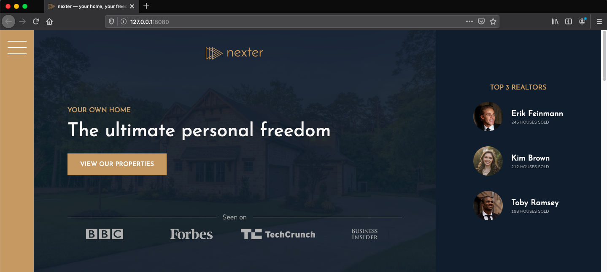

# Nexter

This project is based on the course by Jonas Schmedtmann ["Advanced CSS and Sass"](https://www.udemy.com/course/advanced-css-and-sass/). The project makes use of CSS Grid & Flexbox to build the layout.



### How to install this project

```sh
$ git clone https://github.com/andres-cruz/nexter.git
$ cd nexter
```

### How to run this project

To run the server and compile sass in "watch" mode

```sh
$ npm start
```
